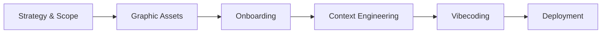

# Meow Meow — Documentation Index

This is the **docs folder** for the Meow Meow Aesthetic Landing Page project. It contains all strategic, graphic, and technical assets produced during the vibecoding master course (strategy, AI-generated visuals, context engineering, and deployment).

Below you will find a simplified tree of the docs structure, the project lifecycle diagram, and a full list of every resource with clickable links.

---

## Docs tree (simplified)

```
docs/
├── I. Strategic Framing
│   ├── Brand Identity/
│   ├── Strategy and Concept/
│   └── Livrable.png
├── II. Graphic Collections
│   ├── Assets/
│   ├── Prompts/
│   ├── graphic-collections.png
│   └── Livrable.png
├── III. Development Environment
├── IV. Context Engineering
├── V. Vibecoding
│   └── Deployment/
└── README.md
```

---

## Project lifecycle (AI-orchestrated DNVB workflow)



---

## All documentation resources

### I. Strategic Framing

| Resource | Link |
|----------|------|
| Strategy and Concept (Markdown) | [Strategy and Concept.md](I.%20Strategic%20Framing/Strategy%20and%20Concept/Strategy%20and%20Concept.md) |
| Strategy and Concept (PDF) | [Strategy and Concept.pdf](I.%20Strategic%20Framing/Strategy%20and%20Concept/Strategy%20and%20Concept.pdf) |
| Strategy and Concept (Image) | [Strategy and Concept.png](I.%20Strategic%20Framing/Strategy%20and%20Concept/Strategy%20and%20Concept.png) |
| Prompt - Brand Identity | [Prompt - Brand Identity.md](I.%20Strategic%20Framing/Brand%20Identity/Prompt%20-%20Brand%20Identity.md) |
| Brand Identity (PDF) | [Brand Identity.pdf](I.%20Strategic%20Framing/Brand%20Identity/Brand%20Identity.pdf) |
| Brand Identity (Image) | [Brand Identity.png](I.%20Strategic%20Framing/Brand%20Identity/Brand%20Identity.png) |
| Strategic deliverable | [Livrable.png](I.%20Strategic%20Framing/Livrable.png) |

### II. Graphic Collections

**Assets**

| Resource | Link |
|----------|------|
| Hero Banner | [hero-banner.png](II.%20Graphic%20Collections/Assets/hero-banner.png) |
| Lifestyle Cosy | [lifestyle-cosy.png](II.%20Graphic%20Collections/Assets/lifestyle-cosy.png) |
| Logo Dark | [logo-dark.png](II.%20Graphic%20Collections/Assets/logo-dark.png) |
| Logo Light | [logo-light.png](II.%20Graphic%20Collections/Assets/logo-light.png) |
| Logo Sticker | [logo-sticker.png](II.%20Graphic%20Collections/Assets/logo-sticker.png) |
| Macro Croquettes | [macro-croquettes.png](II.%20Graphic%20Collections/Assets/macro-croquettes.png) |
| Packaging Angle Front | [packaging-angle-front.png](II.%20Graphic%20Collections/Assets/packaging-angle-front.png) |
| Packaging Banner | [packaging-banner.png](II.%20Graphic%20Collections/Assets/packaging-banner.png) |
| Packaging Collection | [packaging-collection.png](II.%20Graphic%20Collections/Assets/packaging-collection.png) |
| Packaging Front | [packaging-front.png](II.%20Graphic%20Collections/Assets/packaging-front.png) |
| Packaging Poil Soyeux | [packaging-poil-soyeux.png](II.%20Graphic%20Collections/Assets/packaging-poil-soyeux.png) |
| Packaging Saumon | [packaging-saumon.png](II.%20Graphic%20Collections/Assets/packaging-saumon.png) |
| Packaging Vitamines | [packaging-vitamines.png](II.%20Graphic%20Collections/Assets/packaging-vitamines.png) |
| Social Proof Chat Dormant | [social-proof-chat-dormant.png](II.%20Graphic%20Collections/Assets/social-proof-chat-dormant.png) |
| Social Proof Selfie | [social-proof-selfie.png](II.%20Graphic%20Collections/Assets/social-proof-selfie.png) |

**Prompts**

| Resource | Link |
|----------|------|
| Prompt — hero-banner | [Prompt — hero-banner.md](II.%20Graphic%20Collections/Prompts/Prompt%20%E2%80%94%20hero-banner.md) |
| Prompt — lifestyle-cosy | [Prompt — lifestyle-cosy.md](II.%20Graphic%20Collections/Prompts/Prompt%20%E2%80%94%20lifestyle-cosy.md) |
| Prompt — logo | [Prompt — logo.md](II.%20Graphic%20Collections/Prompts/Prompt%20%E2%80%94%20logo.md) |
| Prompt — logo-sticker | [Prompt — logo-sticker.md](II.%20Graphic%20Collections/Prompts/Prompt%20%E2%80%94%20logo-sticker.md) |
| Prompt — macro-croquettes | [Prompt — macro-croquettes.md](II.%20Graphic%20Collections/Prompts/Prompt%20%E2%80%94%20macro-croquettes.md) |
| Prompt — packaging-front | [Prompt — packaging-front.md](II.%20Graphic%20Collections/Prompts/Prompt%20%E2%80%94%20packaging-front.md) |
| Prompt — packaging-poil-soyeux | [Prompt — packaging-poil-soyeux.md](II.%20Graphic%20Collections/Prompts/Prompt%20%E2%80%94%20packaging-poil-soyeux.md) |
| Prompt — packaging-saumon | [Prompt — packaging-saumon.md](II.%20Graphic%20Collections/Prompts/Prompt%20%E2%80%94%20packaging-saumon.md) |
| Prompt — packaging-standard | [Prompt — packaging-standard.md](II.%20Graphic%20Collections/Prompts/Prompt%20%E2%80%94%20packaging-standard.md) |
| Prompt — packaging-vitamines | [Prompt — packaging-vitamines.md](II.%20Graphic%20Collections/Prompts/Prompt%20%E2%80%94%20packaging-vitamines.md) |
| Prompt — social-proof-chat-dormant | [Prompt — social-proof-chat-dormant.md](II.%20Graphic%20Collections/Prompts/Prompt%20%E2%80%94%20social-proof-chat-dormant.md) |
| Prompt — social-proof-selfie | [Prompt — social-proof-selfie.md](II.%20Graphic%20Collections/Prompts/Prompt%20%E2%80%94%20social-proof-selfie.md) |

**Other**

| Resource | Link |
|----------|------|
| Graphic collections overview | [graphic-collections.png](II.%20Graphic%20Collections/graphic-collections.png) |
| Graphic deliverable | [Livrable.png](II.%20Graphic%20Collections/Livrable.png) |

### III. Development Environment

| Resource | Link |
|----------|------|
| Lovable landing | [lovable-landing.png](III.%20Development%20Environment/lovable-landing.png) |
| Lovable sign-up | [lovable-sign-up.png](III.%20Development%20Environment/lovable-sign-up.png) |

### IV. Context Engineering

| Resource | Link |
|----------|------|
| Attach files | [attach_files.png](IV.%20Context%20Engineering/attach_files.png) |
| Chose theme | [chose_theme.png](IV.%20Context%20Engineering/chose_theme.png) |
| Custom colors | [custom_colors.png](IV.%20Context%20Engineering/custom_colors.png) |
| Custom effects | [custom_effects.png](IV.%20Context%20Engineering/custom_effects.png) |
| Custom typography | [custom_typography.png](IV.%20Context%20Engineering/custom_typography.png) |
| Prompt - Context Engineering | [Prompt - Context Engineering.md](IV.%20Context%20Engineering/Prompt%20-%20Context%20Engineering.md) |

### V. Vibecoding

| Resource | Link |
|----------|------|
| Full web site | [full-web-site.png](V.%20Vibecoding/full-web-site.png) |
| Prompting Lovable | [prompting-lovable.png](V.%20Vibecoding/prompting-lovable.png) |
| Publish | [publish.png](V.%20Vibecoding/publish.png) |
| Visit site web (GIF) | [visit-site-web.gif](V.%20Vibecoding/visit-site-web.gif) |
| Visit site web (PNG) | [visit-site-web.png](V.%20Vibecoding/visit-site-web.png) |

**V. Vibecoding / Deployment**

| Resource | Link |
|----------|------|
| Lovable monitor | [lovable-monitor.png](V.%20Vibecoding/Deployment/lovable-monitor.png) |
| Repo Lovable | [repo-lovable.png](V.%20Vibecoding/Deployment/repo-lovable.png) |
| Repo Vercel | [repo-vercel.png](V.%20Vibecoding/Deployment/repo-vercel.png) |
| Vercel | [vercel.png](V.%20Vibecoding/Deployment/vercel.png) |
